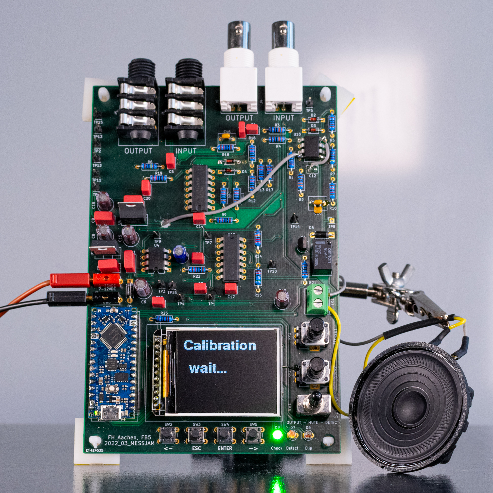

# About

This fork focuses on the **stand-alone audio measurement tool** that was originally developed as part of the [“Making Music over the Internet”](https://github.com/StephanBorucki/MusizierenUeberDasInternet) project.

Here you will find detailed information such as the schematic, PCB layout, bill of materials, Arduino sketches, and usage instructions.

Additional files and documentation will be added over the coming days.

