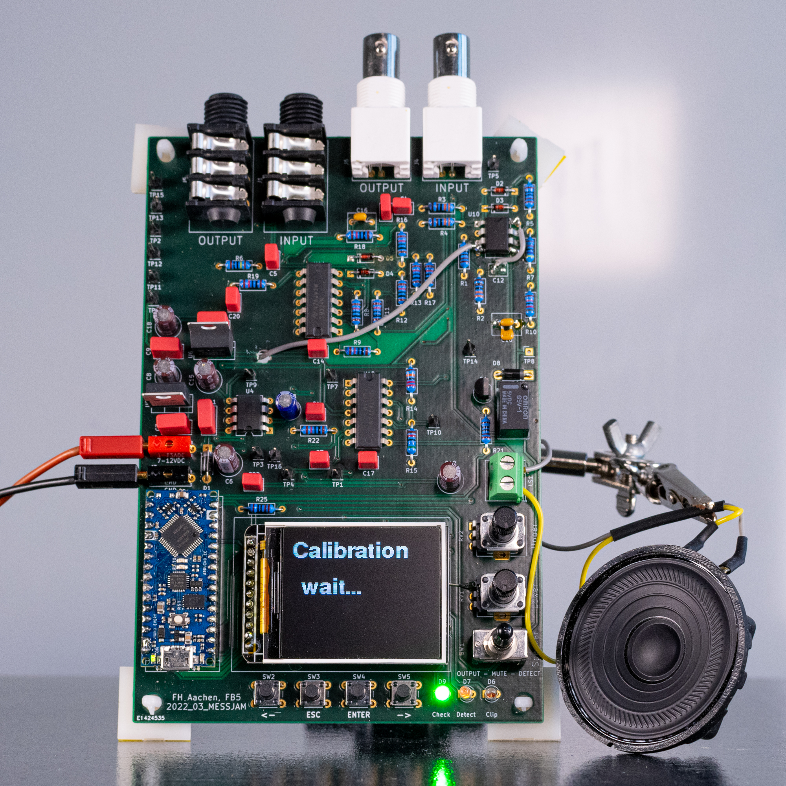

# About

This fork focuses on the **stand-alone audio measurement tool** that was originally developed as part of the [“Making Music over the Internet”](https://github.com/StephanBorucki/MusizierenUeberDasInternet) project.

Here you will find detailed information such as the schematic, PCB layout, bill of materials, Arduino sketches, and usage instructions.

---
## Files
- **Hardware:**
  - [2022](hardware/2022): Original version from 2022
    - Created with KiCad 8
    - Comments in German
    - Includes: Schematic, PCB Layout, Gerber Files, BOM
      
  - [2025](hardware/2025): Published version with corrections
    - Created with KiCad 9
    - Comments in English
    - Includes: Schematic
      
- **Firmware:**
  - [Measurement_03:](firmware/Measurement_03): Version 1.3
    - Measurement_03.ino: imports, pins, constants, variables, main loop of state machine
    - a_setup.ino: pin modes, welcome message on screen
    - b_menu.ino: menu to choose between error detection (DETECT) and latency measurement (BURST) mode
    - c_detect.ino: error detection (DETECT) mode
    - d_burst.ino: latency measurement (BURST) mode
   
> [!TIP]
> Please refer to [Info2022](hardware/2022/Info2022.md) and [Info2025](hardware/2025/Info2025.md) before attempting to recreate this setup.

---
### License
This project is licensed under the [CERN Open Hardware License Version 2 – Permissive (CERN-OHL-P)](https://cern-ohl.web.cern.ch/).

Note: This license applies to the hardware design and firmware hosted here.
The printed article and its photos as published in Elektor remain subject to Elektor’s publishing rights.
